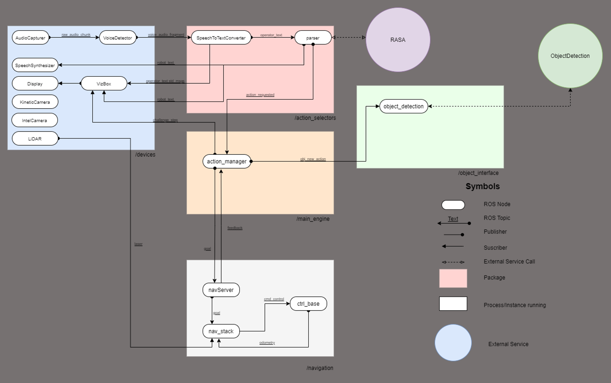

 

# RoBorregos Robocup-Home
This repository contains the development of RoBorregos' robotic solution for [RoboCup's @HOME competition](https://athome.robocup.org/), Open Platform League (OPL), where the robot must be capable of interacting with people, manipulate objects and have intelligent responses for everyday home tasks.

See [RoboCup @HOME Rules](https://robocupathome.github.io/RuleBook/rulebook/master.pdf).

## Project setup

1. Clone the project repository on your local machine.

   SSH:

   ```bash
   $ git clone --recurse-submodules https://github.com/RoBorregos/Robocup-Home.git
   ```

## Project details

This project is made using:
- [ROS Melodic](https://www.ros.org/)
- [Rasa NLU](https://rasa.com/)
- [Tensorflow](https://www.tensorflow.org/learn)
- [PaddlePaddle](https://github.com/paddlepaddle/paddle)
- [Arduino](https://www.arduino.cc/)
- [VIA EPIA](https://www.viatech.com/en/support/eol/epia-eol/)
- [Jetson](https://developer.nvidia.com/EMBEDDED/jetson-nano-developer-kit)

 

For more information about the project system, structure, and development areas you can check our [Official Documentation](https://github.com/RoBorregos/Robocup-Home/wiki).

### Development team

| Name                    | Email                                                               | Github                                                       | Role      |
| ----------------------- | ------------------------------------------------------------------- | ------------------------------------------------------------ | --------- |
| José Cisneros | [joseacisnerosm@gmail.com](mailto:joseacisnerosm@gmail.com) | [@Josecisneros001](https://github.com/Josecisneros001) | PM Software, Speech & Base Control|
| Aldo Samaniego | [aldojesussam0@gmail.com](mailto:aldojesussam0@gmail.com) | [@AldoSamaniego](https://github.com/AldoSamaniego) | PM Mechatronics & Power Supply Electronics|
| Aurora Tijerina | [auro.tj@gmail.com](mailto:auro.tj@gmail.com) | [@AuroTB](https://github.com/aurotb) | Navigation & Integration |
| Ricardo Chapa | [ricardochaparomero@gmail.com](mailto:ricardochaparomero@gmail.com) | [@RicardoChapaRomero](https://github.com/RicardoChapaRomero) | Object Detection |
| Alejandro Ruiz | [alex.01ruiz@hotmail.com](mailto:alex.01ruiz@hotmail.com) | [@BVDozen](https://github.com/BVDozen) | Mechanical Design |
| Iqui Balam  | [iquibalamhm@gmail.com](mailto:iquibalamhm@gmail.com) | [@IquiBalamHM ](https://github.com/IquiBalamHM ) | Object Detection |
| Amin Mendez | [mendezamin.com@gmail.com](mailto:mendezamin.com@gmail.com) | [@AminMendez](https://github.com/AminMendez) | Mechanical Design | 
| Gaby Alvarez | [gabrielaj.alvarez@outlook.com](mailto:gabrielaj.alvarez@outlook.com) | [@gabyjazzmin ](https://github.com/gabyjazzmin ) |  NLP Conversation |
| Anel Alvarado | [anelgtz01@gmail.com](mailto:anelgtz01@gmail.com) | [@AnelAlvarado ](https://github.com/AnelAlvarado ) | Elevator Electronics |
| José Pacheco | [pacocheco7@gmail.com](mailto:pacocheco7@gmail.com) | [@JFPach98 ](https://github.com/JFPach98 ) | Human Detection |
| Alonso Ruiz | [alonsort11@gmail.com](mailto:alonsort11@gmail.com) | [@AlonRuiz](https://github.com/AlonRuiz) | Arm Mechanics |
| Andy Salcedo | [andrea2702@gmail.com](mailto:andrea2702@gmail.com) | [@andrea2702](https://github.com/andrea2702) | Arm Electronics |
| Ignacio Maldonado | [igna-tenkov@gmail.com](mailto:igna-tenkov@gmail.com) | [@IGNA-TENKOV](https://github.com/IGNA-TENKOV) | Mechanical Design |
| Paul Vazquez | [pev@live.com.mx](mailto:pev@live.com.mx) | [@paulvazbad](https://github.com/paulvazbad) | Mentor |
